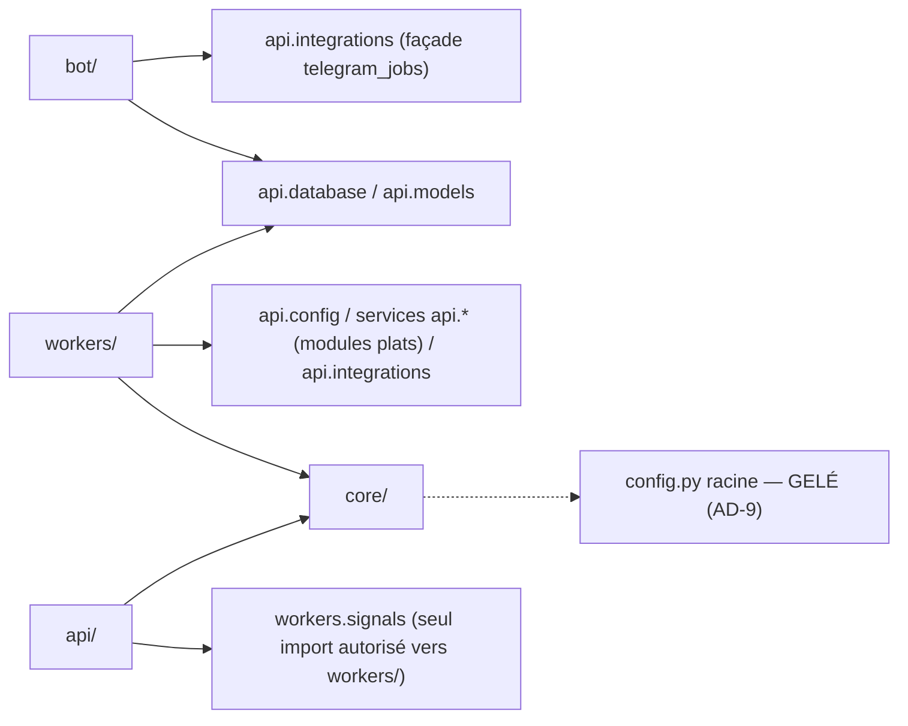
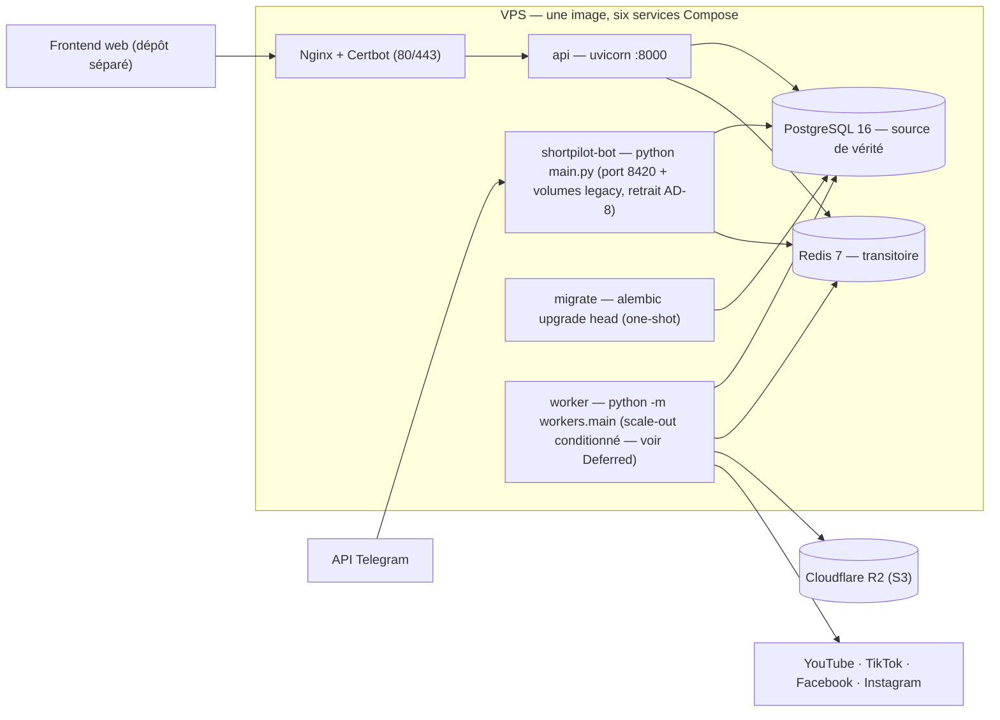
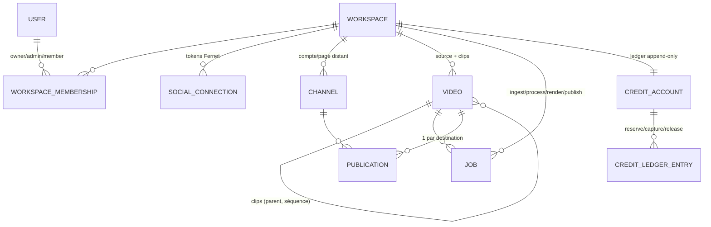

# Architecture Spine — ShortPilot / Omnelyo (backend)

## Design Paradigm

**Monolithe modulaire multi-processus sur file durable détenue par PostgreSQL.**
Une seule image conteneur exécute quatre rôles de processus (`api`, `worker`, `bot`,
`migrate`) ; aucun processus ne détient d'état local durable : tout état métier vit
dans PostgreSQL, tout travail long vit dans la table `jobs`, tout le transitoire vit
dans Redis avec TTL. Les modules (`api/`, `workers/`, `bot/`, `core/`) sont des
frontières de code, pas des services déployables.

## Invariants & Rules

### AD-1 — PostgreSQL, unique source de vérité [ADOPTED]

- **Binds:** tous les modules
- **Prevents:** réémergence d'une seconde persistance métier (divergence d'état entre SQLite/fichiers/Redis et PostgreSQL)
- **Rule:** tout état métier vit dans PostgreSQL via `api/models.py` + migration Alembic dédiée. Redis ne stocke que du transitoire TTL (OTP, états OAuth, jetons de liaison, rate-limit, wakeup). Aucun nouveau fichier, cache ou base ne peut devenir persistant côté métier.

### AD-2 — Périmètre de dépendance Redis [ADOPTED]

- **Binds:** api/, workers/, bot/
- **Prevents:** croyance « Redis optionnel » contredite par un crash de login
- **Rule:** Redis est **requis** pour les flux d'authentification/liaison (OTP, état OAuth social, jeton Telegram) et **best-effort** ailleurs : rate-limiting fail-open, wakeup dégradé en polling PostgreSQL. Toute nouvelle utilisation de Redis doit déclarer son mode de dégradation.

### AD-3 — Isolation multi-tenant par filtre explicite [ADOPTED]

- **Binds:** toutes les routes, requêtes et clés de stockage
- **Prevents:** fuite cross-tenant via un oubli de filtre
- **Rule:** l'accès tenant passe par `get_current_workspace_membership` / `require_workspace_roles` (`api/dependencies.py`) ; toute requête sur table possédée répète `workspace_id ==` ; workspace étranger ou absent ⇒ **404** (jamais 403). Les clés R2 embarquent le workspace et sont revérifiées par `belongs_to_workspace` (`core/storage_keys.py`). Une ressource ne change jamais de workspace.

### AD-4 — File durable : sémantique de claiming et de bail [ADOPTED]

- **Binds:** workers/, tout producteur de jobs (api/, bot/)
- **Prevents:** double exécution par claiming naïf, jobs fantômes, file parallèle
- **Rule:** tout travail long est une ligne `jobs` PostgreSQL. Le claiming passe exclusivement par `claim_next_job` (`FOR UPDATE SKIP LOCKED`, statut QUEUED, `available_at` écoulé, tentatives restantes). La propriété d'un job = (statut RUNNING + `worker_id`) ; heartbeat et `recover_stale_jobs` sont les seuls mécanismes de reprise. **Toute transition de statut (claim, complete, fail, defer, annulation, retry) passe exclusivement par `workers/job_state.py` sous verrou de ligne** — y compris celles déclenchées par les routes et le bot. Le signal Redis n'est jamais autoritaire. Aucun travail long in-process dans `api/` ou `bot/`.

### AD-5 — Dead-letter terminal [ADOPTED]

- **Binds:** jobs, crédits, publications
- **Prevents:** sémantiques de retry divergentes entre producteurs
- **Rule:** après épuisement de `max_attempts`, FAILED est **terminal et permanent** : l'endpoint de retry refuse, l'annulation n'accepte que QUEUED. La récupération passe par un nouveau job ou une intervention manuelle en base. `JobDeferred` refile sans consommer de tentative (polling fournisseur).

### AD-6 — Enchaînement des étapes piloté par le client [ADOPTED]

- **Binds:** pipeline INGEST → PROCESS → RENDER → PUBLISH
- **Prevents:** orchestrateur implicite divergent entre web et bot
- **Rule:** aucun handler n'enfile l'étape suivante ; l'API est l'orchestrateur (le client POSTe chaque étape, `video_id` requis hors INGEST). **Au plus un job non-terminal par cible :** un job PUBLISH actif par publication, un job actif par `(video_id, type)` — l'enqueue réutilise le job existant plutôt que d'en créer un doublon (sinon deux RENDER = deux réservations de crédit pour un rendu). Chaque étape doit rester rejouable/idempotente (PROCESS réutilise les clips READY, RENDER court-circuite si rendu existant, PUBLISH réconcilie par `external_id`).

### AD-7 — Argent : prix serveur, ledger append-only, idempotence [ADOPTED]

- **Binds:** facturation, crédits, quotas, webhooks
- **Prevents:** confiance en montants/client, doubles crédits, fulfilment divergent
- **Rule:** les prix viennent exclusivement de `provider_price_mappings`. Le ledger de crédits est append-only (solde = somme des écritures) avec cycle reserve/capture/release lié à l'issue du job RENDER. **`WorkspaceEntitlement` a un unique rédacteur : le service de fulfilment sous verrou de ligne** (changement de plan, grant mensuel, extension) — aucun autre module n'écrit les entitlements. Toute opération financière est idempotente par contrainte unique `(portée, idempotency_key)`. Tout webhook est vérifié (signature Dodo, `get_payment` MoneyFusion) **avant** fulfilment ; les événements non corrélés sont stockés et rejetés 409.

### AD-8 — Chemin unique de connexion sociale [ADOPTED]

- **Binds:** intégrations YouTube/TikTok/Facebook/Instagram, bot
- **Prevents:** double stack OAuth (tokens fichier vs base chiffrée)
- **Rule:** chaque plateforme implémente le contrat `SocialPublisher` (`api/integrations/social.py`), adaptateurs sans état, enregistrés dans le registre. Les tokens vivent uniquement dans `SocialConnection`, chiffrés Fernet (`SOCIAL_CREDENTIALS_KEY`), jamais en fichier ni en log. L'ancien chemin OAuth du bot (serveur Flask :8420, `core/youtube_auth.py`, `core/youtube_uploader.py`) est voué à disparaître : aucun nouveau code ne doit l'étendre.

### AD-9 — Système de configuration unique [DÉCIDÉ — migration en attente]

- **Binds:** api/, workers/, bot/, core/
- **Prevents:** dérive de configuration double + crash latent en prod read-only
- **Rule:** `api/config.py` (pydantic-settings, validateurs de production) est l'unique source de réglages. Le `config.py` racine (`os.getenv` + `mkdir` à l'import) est gelé : **aucun nouveau réglage ne doit y être ajouté** ; sa retraite est un chantier prioritaire (crash `read_only` en prod, boutons morts `JOB_*`).

### AD-10 — Langue utilisateur : français [ADOPTED]

- **Binds:** messages d'erreur API, messages du bot, copy utilisateur
- **Prevents:** mélange FR/EN non conventionné
- **Rule:** toute chaîne visible de l'utilisateur est en français (docs et commits suivent leurs conventions propres : docs FR, commits EN conventionnels).

### Diagramme de dépendance (règle)



**Règle de direction :** `core/` n'importe jamais api/workers/bot ; `api/` n'importe de `workers/` que `workers.signals` ; `bot/` n'atteint la base tenant que via les façades `api.*` ; `workers/` importe `api.*` et `core/` librement, jamais l'inverse pour la logique métier.

## Consistency Conventions

| Concern | Convention |
| --- | --- |
| Nommage | `shortpilot` interne (code, env, CI) ; `omnelyo` public (domaines, image, VPS). Routes : `/v1/workspaces/{workspace_id}/<ressource>`. Fichiers Python snake_case, un module par domaine. |
| Données & formats | PK UUID v4 ; enums persistés en minuscules ; `created_at`/`updated_at` via `server_default=func.now()` ; invariants de table par `CheckConstraint`/`UniqueConstraint` ; `X-Request-ID` propagé (ContextVar). |
| État & cross-cutting | Services sans état recevant `db: Session`, `flush()` interne — commit par routes/handlers ; concurrence = verrous de lignes PostgreSQL + contraintes uniques, jamais de verrou applicatif ; logs JSON corrélés ; mutations `/v1` tracées dans `audit_events`. |
| Erreurs | Vocabulaire de statut stable : 404 absent/étranger · 409 conflit d'état · 422 validation · 429 quota · 402 crédits insuffisants · 503 fonctionnalité non configurée. Erreurs service = sous-classes de `ValueError`, traduites en HTTP par les routes. |
| Config | pydantic-settings `api/config.py` uniquement (AD-9) ; validateurs qui échouent dur en production ; secrets par environnement, jamais en base autrement que chiffrés (Fernet). |
| Stockage objets | Clés `workspaces/{ws}/videos|jobs|media-assets/...` ; buckets privés ; lecture uniquement par URL présignée ; suppression compensatrice en cas d'échec d'enregistrement. |

## Stack

| Name | Version |
| --- | --- |
| Python | 3.11 en image prod (python:3.11-slim-bookworm) — CI teste en 3.12 : à aligner (voir Deferred) |
| FastAPI | ≥ 0.115.0 (bornes minimales, pas de pin — voir Deferred) |
| SQLAlchemy | ≥ 2.0.32 (psycopg 3 ≥ 3.2.0) |
| Alembic | ≥ 1.13.2 |
| pydantic-settings | ≥ 2.4.0 |
| PostgreSQL | 16 (postgres:16-alpine) |
| Redis | 7 (redis:7-alpine, appendonly) |
| python-telegram-bot | ≥ 21.0 |
| boto3 (R2, API S3) | ≥ 1.34.0 |
| uvicorn | ≥ 0.30.0 |
| yt-dlp | ≥ 2024.8.6 (fraîcheur critique : extracteurs plateformes) |
| dodopayments | ≥ 1.111.0, < 1.112 (pin — seul vrai pin du dépôt avec apiMoneyFusion) |
| apiMoneyFusion | ≥ 0.1.4, < 0.2 (pin) |
| FFmpeg / ffprobe | binaire image système (Dockerfile) |
| Nginx + Certbot | terminaison HTTPS VPS (deploy/nginx/) |

## Structural Seed

### Topologie de déploiement (enveloppe opérationnelle)



Environnements : dev (override Compose, hot-reload, ports publiés), prod (overlay durci : `read_only` + tmpfs pour **api et worker** — le bot reste inscriptible tant que AD-8 n'est pas exécuté ; secrets obligatoires `${VAR:?}`, image immuable SHA → GHCR, rollback applicatif ; scripts VPS dans `scripts/`, templates Nginx dans `deploy/nginx/`). CI GitHub Actions : tests unitaires + couverture, intégration PostgreSQL éphémère, validation Compose, déploiement staging VPS sur `main`.

### Entités cœur (noms et relations)



### Arbre source (scaffold)

```text
{root}/
  api/         # socle SaaS : app, config, models, routes /v1, auth, intégrations, services (crédits, quotas, facturation)
  workers/     # runner + job_state (file durable), handlers INGEST/PROCESS/RENDER/PUBLISH
  bot/         # Telegram + (legacy Flask OAuth — à retirer)
  core/        # pipeline vidéo : yt-dlp, scènes, découpe, LLM, TTS, overlay, FFmpeg, R2
  migrations/  # Alembic — chaîne linéaire, URL depuis API_DATABASE_URL
  deploy/      # templates Nginx (scripts VPS bootstrap/DNS dans scripts/)
  tests/       # unittest + suite d'intégration PostgreSQL
```

## Deferred

- **Auto-chaînage des étapes pipeline** (worker enfile l'étape suivante) — attend que le frontend prouve que le pilotage client est une charge.
- **Propriétaire du dispatch programmé** : qui convertit `scheduled_at` en job PUBLISH (scheduler dédié vs enqueue différé via `available_at`) — à décider avant tout épique « calendrier de publication » ; l'AD-6 (un seul job actif par cible) borne déjà les dégâts.
- **Déduplication à l'enqueue REST** : l'invariant AD-6 « un job actif par `(video_id, type)` » n'est pas encore mécaniquement garanti côté `POST /jobs` (implémentation à faire, avec neutralisation de la seconde réservation de crédit).
- **Fenêtre de double exécution PUBLISH** (pas de clé d'idempotence fournisseur, écrasement inconditionnel d'`external_id`) — dette assumée ; revisiter avant tout scale-out multi-worker ou premier incident de doublon.
- **Expiration des crédits** (le type EXPIRE existe, jamais écrit) et **débit des crédits au remboursement** — attendent la validation de la grille tarifaire.
- **Équité multi-worker** (limite de concurrence par workspace, index composite `(status, available_at)`) — à traiter avec la montée en charge.
- **Comptabilisation du stockage `media_assets`** (quota et usage l'ignorent) et **rétention vs publications programmées** référençant un actif — avant l'épique médiathèque.
- **Purge workspace (RGPD) vs préservation des écritures financières** (`partner_commissions` en FK RESTRICT) — politique à décider avant l'épique partenaires ; aucune AD ne tranche encore.
- **Partage d'un compte distant entre workspaces** : l'unicité globale `(platform, external_id)` sur `channels` l'interdit aujourd'hui — à assumer ou relâcher explicitement si un cas d'usage agence émerge.
- **Couverture d'audit** : `audit_events` ne trace que les mutations `/v1` ; les mutations via bot/workers restent silencieuses — à étendre quand le besoin conformité arrive.
- **Garde mécanique du filtre tenant** (AD-3) : repose sur la discipline de revue ; un test/lint dédié serait le garde-fou.
- **Migration des réglages LLM/TTS/email vers `api/config.py`** : ils vivent dans le `config.py` racine gelé (AD-9) — tout nouvel épique « fournisseur IA » doit d'abord les migrer ; le registre LLM OpenAI-compatible et le TTS OpenAI-seul sont la reality actuelle.
- **Fenêtre de montée Redis 8.x** : Redis 7.4 est en maintenance sécurité uniquement — planifier avant la fin de fenêtre.
- **Alignement d'interpréteur Python** : image prod 3.11 vs CI 3.12 — aligner les deux sur une version.
- **Observabilité prod** (métriques, alertes, sauvegardes testées, rétention/suppression données) — possédée par la feuille de route ops (`docs/implementation-backend.md` Phase 7).
- **Routes du programme partenaires** — modèles et service existent, aucune route ; à spécifier avec BMAD (PRD/spéc) avant implémentation.
- **Rétention R2 automatisée** (cycles de vie par préfixe) — bloquée par la validation des règles de rétention business.
- **Pin des dépendances** (`requirements.lock`) — le jour où une régression de build survient (décision déjà consignée).
- **Nettoyages inertes** : `__pycache__` dans db/scheduler/billing, `core/youtube_uploader.py`, dépendances mortes (APScheduler, moviepy, ffmpeg-python, playwright), commentaire obsolète « SQLite » dans `requirements.txt` — opportunistes, via bmad-build.
